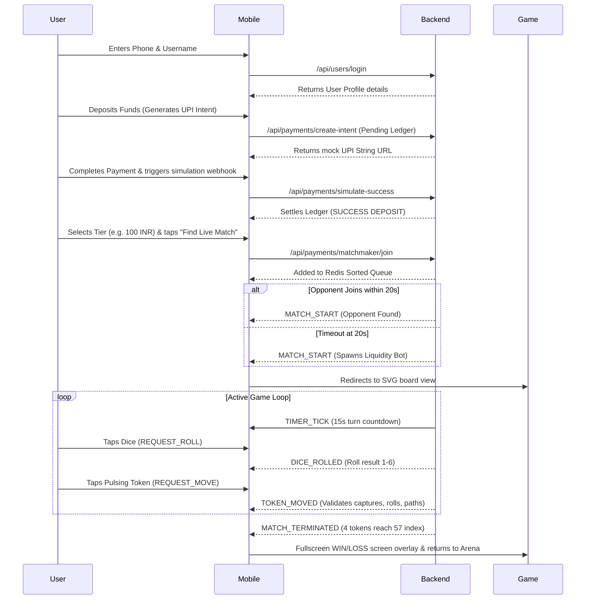
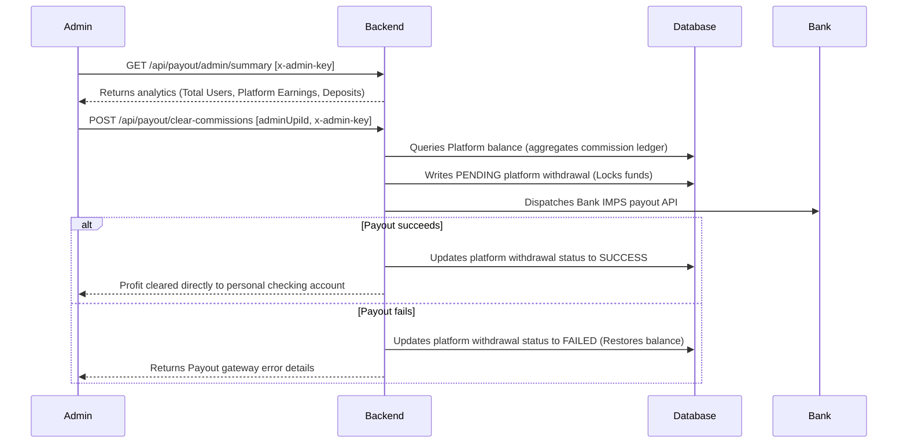

# Real-Money Ludo Platform: System Architecture & Summary

This monorepo contains the comprehensive implementation of our high-concurrency, server-authoritative Real-Money Ludo Mobile Game platform.

---

## 🚀 1. Universal Architecture & Tech Stack
The platform operates as a decoupled client-server architecture:
1. **Server Engine**: Node.js + Express + TypeScript running behind ALB.
2. **State & Storage**:
   *   **Redis**: Caches live match states (`room:match_id`) and manages fee-based matchmaking queues.
   *   **MongoDB (Mongoose)**: Manages persistent profiles and transactions via a secure double-entry ledger.
3. **Mobile Client**: React Native via Expo Bare Workflow drawing a 2D vector board using high-performance SVG canvas rendering.

---

## 🛠️ 2. File Directory Checklist (What We Built)

### A. Backend Services
*   [backend/src/config/db.ts](file:///g:/Ludo/backend/src/config/db.ts): MongoDB connections & ACID transaction wrappers.
*   [backend/src/config/redis.ts](file:///g:/Ludo/backend/src/config/redis.ts): Caches match state JSON.
*   [backend/src/models/User.ts](file:///g:/Ludo/backend/src/models/User.ts): User profile schema.
*   [backend/src/models/Transaction.ts](file:///g:/Ludo/backend/src/models/Transaction.ts): Double-entry immutable ledger & balance calculator.
*   [backend/src/controllers/paymentController.ts](file:///g:/Ludo/backend/src/controllers/paymentController.ts): Webhook signature check & developer sandbox success triggers.
*   [backend/src/controllers/payoutController.ts](file:///g:/Ludo/backend/src/controllers/payoutController.ts): User IMPS payout request, platform commission settlement, and platform analytical summary.
*   [backend/src/services/gameEngine.ts](file:///g:/Ludo/backend/src/services/gameEngine.ts): Coordinates map pathing, token lock rules, and 6-roll constraints.
*   [backend/src/services/socketManager.ts](file:///g:/Ludo/backend/src/services/socketManager.ts): Socket events, 15s turn timer, and 60s reconnection forfeit grace period.
*   [backend/src/services/matchmaker.ts](file:///g:/Ludo/backend/src/services/matchmaker.ts): 20s sorted matchmaking matching loop & bot injector.
*   [backend/src/services/botDriver.ts](file:///g:/Ludo/backend/src/services/botDriver.ts): Human-like delayed moves (1.5s–3s) and weighted AI token-selection matrix.
*   [backend/src/models/Tournament.ts](file:///g:/Ludo/backend/src/models/Tournament.ts): Mongoose Tournament Schema.
*   [backend/src/controllers/tournamentController.ts](file:///g:/Ludo/backend/src/controllers/tournamentController.ts): API routes for tournament lists and transaction-wrapped entry fees.
*   [backend/src/services/challengeTracker.ts](file:///g:/Ludo/backend/src/services/challengeTracker.ts): Progress metric caching inside Redis & Mongoose ledger credits.
*   [backend/src/controllers/leaderboardController.ts](file:///g:/Ludo/backend/src/controllers/leaderboardController.ts): Query Top 50 Users by earnings.
*   [backend/src/server.ts](file:///g:/Ludo/backend/src/server.ts): Main Express socket mounting.

### B. Mobile client
*   [mobile-client/App.tsx](file:///g:/Ludo/mobile-client/App.tsx): Root application Router linking screens and OTA updates.
*   [mobile-client/app.json](file:///g:/Ludo/mobile-client/app.json): Version policy configurations for Expo OTA updates.
*   [mobile-client/src/hooks/useAppAutoUpdate.ts](file:///g:/Ludo/mobile-client/src/hooks/useAppAutoUpdate.ts): Silent background OTA manifest fetching.
*   [mobile-client/src/hooks/useSocket.ts](file:///g:/Ludo/mobile-client/src/hooks/useSocket.ts): Client socket connection wrap.
*   [mobile-client/src/hooks/useWallet.ts](file:///g:/Ludo/mobile-client/src/hooks/useWallet.ts): API wraps for cash additions and instant payouts.
*   [mobile-client/src/screens/AuthWalletScreen.tsx](file:///g:/Ludo/mobile-client/src/screens/AuthWalletScreen.tsx): UI cards for deposits, withdrawals, ledger logs, and compliance drawers.
*   [mobile-client/src/screens/DashboardScreen.tsx](file:///g:/Ludo/mobile-client/src/screens/DashboardScreen.tsx): Entry fee tier cards, private room sharers, and leaderboard/challenge redirects.
*   [mobile-client/src/screens/GameScreen.tsx](file:///g:/Ludo/mobile-client/src/screens/GameScreen.tsx): SVG 2D board rendering, dice controllers, and fullscreen result modals.
*   [mobile-client/src/screens/LeaderboardScreen.tsx](file:///g:/Ludo/mobile-client/src/screens/LeaderboardScreen.tsx): Top 3 player podium and ranks 4-50 listing.
*   [mobile-client/src/screens/ChallengeScreen.tsx](file:///g:/Ludo/mobile-client/src/screens/ChallengeScreen.tsx): Render daily progress bar cards and cash badges.
*   [mobile-client/assets/](file:///g:/Ludo/mobile-client/assets): Premium generated assets (`icon.png`, `splash.png`, `adaptive-icon.png`, `favicon.png`).

---

## 🎮 3. Detailed User Flow

---

## 👑 4. Admin Panel & Flow Analytics
We implemented a secure, authenticated Admin Analytics & Settlement system. Because we enforce a strict double-entry ledger design, platform commission earnings are tracked as a unique running credit balance tied to a virtual platform user ID (`000000000000000000000000`).

### Admin Capabilities & Flow:
1.  **Monitor Platform Statistics**:
    *   **Action**: Admin makes a `GET` request to `/api/payout/admin/summary` with header `x-admin-key: <ADMIN_API_KEY>`.
    *   **Result**: The server counts registered users, sums all platform deposits and withdrawals, and queries the ledger for net accumulated commissions.
2.  **Withdraw Platform Commissions (Commissions Payout)**:
    *   **Action**: Admin makes a `POST` request to `/api/payout/clear-commissions` with target UPI ID and `x-admin-key` header.
    *   **Result**: The server checks the virtual platform user's balance, locks the uncleared earnings by writing a `PENDING` Platform withdrawal debit, and initiates a bank payout transfer (IMPS) to clear the funds directly to the admin's personal bank account.

