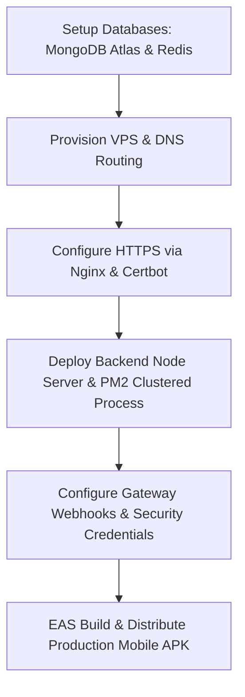

# Nexus Ludo: Production Deployment & Architecture Blueprint

This document details the technologies, external platforms, third-party integrations, infrastructure specifications, and step-by-step workflows required to deploy the **Nexus Ludo** real-money gaming application into a live production environment.

---

## 🏗️ 1. Technical Stack Overview

The application utilizes a decoupled, high-concurrency client-server architecture.

### Backend Services (`backend/`)
*   **Runtime & Language**: Node.js & TypeScript
*   **Web Framework**: Express.js
*   **Real-Time Subsystem**: WebSockets via `Socket.io` (integrated with `@socket.io/redis-adapter` for horizontal scaling/clustering)
*   **Primary Database**: MongoDB (via `Mongoose`) using replica set ACID sessions (`runInTransaction`) for financial ledger operations
*   **Caching & Queue Broker**: Redis (manages live matchmaking queues, JWT blacklists, and rate-limiting blocks)
*   **Process Management**: `PM2` (process clustering, monitoring, and zero-downtime reloads)
*   **Web Server / Reverse Proxy**: Nginx (handling port forwarding, WebSocket upgrades, rate limiting, and SSL termination)
*   **SSL Certificates**: Let's Encrypt (using Certbot for automated SSL generation and renewals)

### Mobile Client (`mobile-client/`)
*   **Framework**: React Native via Expo SDK 54 (Bare Workflow configuration)
*   **Language**: TypeScript
*   **Graphics & Render Engine**: `react-native-svg` (renders the 2D game board, cells, dice, tokens, and visual state indicators dynamically)
*   **Animations**: `react-native-reanimated` (for token jumps, roll spins, and slide overlays)
*   **Audio Controller**: `expo-av` (for background audio and game sound effects)
*   **OTA (Over-The-Air) Updates**: `expo-updates` (silent background assets/JS bundle sync)
*   **Build Compiler**: Expo Application Services (EAS Build)

---

## 🌐 2. Cloud Infrastructure & Platform Requirements

To host and scale the platform, the following infrastructure accounts must be provisioned:

### A. Hosting Infrastructure
1.  **Virtual Private Server (VPS)**:
    *   *Role*: Hosts the Node.js Express server & WebSockets connection manager.
    *   *Specifications*: Minimum **2 vCPU, 8GB RAM** (Ubuntu 22.04 LTS recommended) to support active WebSocket traffic and the Ludo game-loop processes.
    *   *Providers*: AWS (EC2 t3.large), DigitalOcean (General Purpose Droplet), Hostinger KVM, or Linode.
2.  **MongoDB Atlas (Database-as-a-Service)**:
    *   *Role*: Stores user data, secure ledger entries, and tournament definitions.
    *   *Specifications*: Dedicated cluster (M10 tier or higher). A replica set is **mandatory** because the backend utilizes Mongoose ACID sessions to secure wallet deposits, fees, and winnings.
3.  **Redis Cache Cluster**:
    *   *Role*: Manages real-time queue states, session lists, rate limits, and Socket.io adapter messages.
    *   *Providers*: Redis Labs (Managed Cloud), Upstash, AWS ElastiCache, or a separate self-hosted Redis container configured with secure TLS.

### B. Third-Party Services & API integrations
4.  **Real-Money Payment Gateway**:
    *   *Role*: Manages UPI, Net Banking, and Cards deposits (Payins), plus automated withdrawal settlements (Payouts).
    *   *Providers*: Razorpay (using RazorpayX API for corporate IMPS payouts) or Cashfree (using Payouts API).
    *   *Requirement*: A registered business entity with corporate bank accounts and approved compliance documentation for real-money gaming (RMG) in India.
5.  **Transactional SMS Gateway**:
    *   *Role*: Sends mobile verification OTPs to authenticate users and mitigate automated bot account generation.
    *   *Providers*: MSG91, Twilio, or Fast2SMS.
6.  **Domain & DNS Manager**:
    *   *Role*: Standardizes URLs for web services and SSL routing.
    *   *Providers*: GoDaddy, Namecheap, or AWS Route 53.
    *   *Domain Setup*: E.g., `ludoarena.com` (Main Website/Direct APK Download) and `api.ludoarena.com` (API endpoint pointed to VPS IP via DNS `A` records).
7.  **Enterprise Business Email**:
    *   *Role*: Essential for payment gateway approval, compliance registration, and user support operations.
    *   *Providers*: Zoho Mail, Google Workspace.

### C. App Distribution Accounts
8.  **Expo CLI & EAS Account**:
    *   *Role*: Compiles React Native native code (Java/Objective-C wrapper changes) into production-signed packages.
9.  **Google Play Developer Console**:
    *   *Role*: Official distribution of the Ludo application (requires real-money game verification/compliance depending on local legal requirements).
    *   *Alternative*: Self-host the `.apk` bundle on the root website for direct download.

---

## 🛠️ 3. Environment Variables Configuration

The production server requires a configured `.env` file inside the `backend/` directory.

```env
# Application Settings
PORT=5000
NODE_ENV=production
JWT_SECRET=super_secure_random_64_character_hex_string
ADMIN_API_KEY=admin_api_dispute_secret_key_for_backoffice

# Database Connection URIs
# MongoDB must be a replica set (Atlas cluster connection string includes replica set query params automatically)
MONGO_URI=mongodb+srv://<db_user>:<db_pass>@cluster0.mongodb.net/ludo?retryWrites=true&w=majority
REDIS_URL=redis://:<redis_password>@<redis_host>:<redis_port>

# Payment Gateway (Razorpay/Cashfree)
PAYMENT_GATEWAY=razorpay # or cashfree
RAZORPAY_KEY_ID=rzp_live_your_live_key
RAZORPAY_KEY_SECRET=your_razorpay_live_secret
PAYMENT_WEBHOOK_SECRET=your_webhook_validation_secret_for_authenticity

# SMS API Keys
SMS_API_KEY=your_msg91_or_sms_gateway_credential
SMS_SENDER_ID=your_registered_6_char_header
```

The production server url must also be specified in the mobile client settings (`mobile-client/src/hooks/useSocket.ts` or relevant config file) targeting the secure HTTPS gateway `https://api.yourdomain.com`.

---

## 🚀 4. Step-by-Step Launch & Deployment Plan



### Step 1: Databases Provisioning
1.  Initialize MongoDB Atlas cluster (M10 tier). Add a database user. Add the server's public IP address to the Atlas Network Access whitelist.
2.  Setup Redis Cluster. Ensure it is accessible only by the VPS IP address on port `6379`.

### Step 2: VPS Server Setup
1.  SSH into your VPS. Install Node.js v20+, Git, and Nginx:
    ```bash
    sudo apt update
    sudo apt install -y nodejs npm git nginx
    ```
2.  Install PM2 globally:
    ```bash
    sudo npm install -g pm2
    ```

### Step 3: Domain SSL & Reverse Proxy Setup
1.  In your DNS registrar (e.g. GoDaddy), create an `A` record for `api.yourdomain.com` pointing to the VPS IP.
2.  Install Certbot on the VPS:
    ```bash
    sudo apt install certbot python3-certbot-nginx
    ```
3.  Configure Nginx site configuration (`/etc/nginx/sites-available/default`):
    ```nginx
    server {
        server_name api.yourdomain.com;

        location / {
            proxy_pass http://localhost:5000;
            proxy_http_version 1.1;
            proxy_set_header Upgrade $http_upgrade;
            proxy_set_header Connection "upgrade";
            proxy_set_header Host $host;
            proxy_cache_bypass $http_upgrade;
            proxy_set_header X-Forwarded-For $proxy_add_x_forwarded_for;
            proxy_set_header X-Forwarded-Proto $scheme;
        }
    }
    ```
4.  Generate free Let's Encrypt SSL certificates:
    ```bash
    sudo certbot --nginx -d api.yourdomain.com
    ```
5.  Test Nginx and reload configuration:
    ```bash
    sudo nginx -t
    sudo systemctl reload nginx
    ```

### Step 4: Deploy & Run Backend Engine
1.  Clone the repository on the VPS. Navigate to the `backend/` directory.
2.  Create and fill the `.env` file using production credentials.
3.  Install dependencies:
    ```bash
    npm ci
    ```
4.  Compile TypeScript files:
    ```bash
    npm run build
    ```
5.  Start backend processes in clustered mode using PM2:
    ```bash
    pm2 start ecosystem.config.js --env production
    pm2 save
    pm2 startup
    ```

### Step 5: Webhooks & Verification
1.  Register the backend webhooks inside the Razorpay/Cashfree dashboard to catch asynchronous transaction status updates (deposit resolutions).
2.  Set the webhook endpoint target to `https://api.yourdomain.com/api/payments/webhook`.

### Step 6: Mobile Client Build & Publishing
1.  On your local development machine, navigate to `mobile-client/`.
2.  Configure your EAS project credentials in `app.json`:
    ```bash
    npm install -g eas-cli
    eas login
    ```
3.  Check configuration, set production API endpoint variables, and bundle target resources:
    ```bash
    eas build --platform android --profile production
    ```
4.  Download the generated `.apk` file from the Expo build dashboard.
5.  Publish the APK directly on the root website for immediate downloads, or submit it to the Google Play Store.

---

## 🔒 5. Key Production Security & Compliance Checklist

*   [ ] **HTTPS Enforcement**: Ensure SSL is mandatory. Client socket instances must connect using `wss://api.yourdomain.com`.
*   [ ] **Strict MongoDB Network Whitelisting**: Disable `0.0.0.0/0` access. Allow connections exclusively from the production VPS IP address.
*   [ ] **Rate Limiting**: Confirm that Express rate-limiting middleware is enabled for auth routes to block DDoS attacks.
*   [ ] **Webhook HMAC Security**: Ensure all incoming transaction webhooks verify the HMAC-SHA256 signature generated by the payment provider.
*   [ ] **KYC and Compliance**: Confirm user Aadhaar/PAN upload functions are verified before allowing manual winnings withdrawals.
*   [ ] **Admin Protection**: Ensure developer accounts (`7024065858`, `9302561971`, `7389927777`) use custom strong passwords or hardware tokens if their OTP is bypassed, or configure secure OTP logic to replace the test master key `123456` in production.
