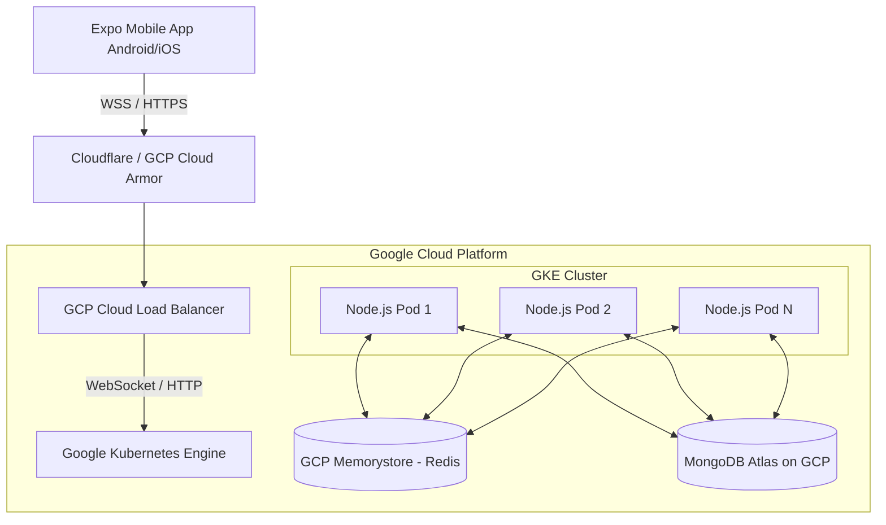

# Nexus-Ludo Production Hosting & Deployment Blueprint (GCP)

> [!WARNING]
> **Architecture Clarification**
> Your initial reference document mentioned Next.js, Go, and PostgreSQL. However, based on my deep analysis of the *actual* codebase in this repository (`package.json` files), the project is currently built with:
> - **Backend**: Node.js, Express, Socket.io, Mongoose (MongoDB)
> - **Cache & Pub/Sub**: Redis (via `@socket.io/redis-adapter`)
> - **Frontend**: React Native via Expo (Mobile Client)
>
> This deployment plan is specifically tailored to the **actual technologies used in your codebase** to support 30,000 Concurrent Active Users (CCU) handling real-time WebSockets.

---

## 1. System Architecture Overview

To support 30,000 real-time WebSocket connections (CCU) securely and with low latency (<100ms), we must decouple the persistent database layer from the high-throughput real-time game cluster.

## 2. Component Mapping & Sizing

| Layer | Technology | Recommended GCP Service | Sizing for 30k CCU |
|---|---|---|---|
| **Mobile App** | Expo / React Native | Expo Application Services (EAS) | N/A (Client-side) |
| **Game Server** | Node.js + Socket.io | Google Kubernetes Engine (GKE) | 5x `e2-standard-4` Nodes (20 vCPU total) running ~15-20 Pods |
| **State Sync/Cache**| Redis | GCP Memorystore (Standard Tier) | 5 GB Capacity (High Availability) |
| **Primary Database**| MongoDB (Mongoose) | MongoDB Atlas (Deployed on GCP) | M30 or M40 Dedicated Cluster |
| **Ingress/Routing** | HTTPS / WSS | GCP Cloud Load Balancing | Global External HTTP(S) LB |

---

## 3. Deployment Strategy (Step-by-Step)

### Phase 1: Database & Redis Provisioning
1. **MongoDB Atlas**: Since the app uses Mongoose, provision a MongoDB Atlas Dedicated Cluster (M30 tier) hosted on GCP in your target region (e.g., `asia-south1`). Enable VPC peering between Atlas and your GCP network for secure, zero-egress-cost communication.
2. **GCP Memorystore**: Deploy a Standard Tier Redis instance (which provides cross-zone replication and auto-failover). This is critical because the `@socket.io/redis-adapter` uses Redis Pub/Sub to route messages between different Node.js pods.

### Phase 2: Stateful Game Cluster (GKE)
1. **Containerization**: Write a multi-stage Dockerfile for the Node.js backend.
2. **GKE Cluster**: Provision a standard GKE cluster with auto-scaling.
3. **WebSocket Configuration**: 
   - Deploy Node.js pods with anti-affinity rules to spread them across zones.
   - Configure **Session Affinity (Sticky Sessions)** on the GCP Load Balancer. Socket.io requires HTTP long-polling to upgrade to WebSockets; sticky sessions ensure the handshake hits the same pod.
4. **Horizontal Pod Autoscaling (HPA)**: Configure HPA based on CPU utilization (target 60-70%) and custom metrics (active socket connections per pod).

### Phase 3: Mobile Client Delivery
1. Use **EAS Build** to compile production AAB (Android) and IPA (iOS) files.
2. Ensure the Socket.io client in the React Native app implements exponential backoff reconnection logic to prevent a "thundering herd" if a GKE node restarts.

---

## 4. Actual Cost Estimate Breakdown (~30,000 CCU)

*Note: Prices are estimates based on current GCP `asia-south1` (Mumbai) rates.*

> [!TIP]
> **Bandwidth Optimization**
> Real-time games generate significant egress. Ensure your Socket.io events are sending minimal, compressed JSON or binary payloads to keep the 3-5 TB egress cost in check.

| Component / Service | Configuration Specs | Estimated Monthly Cost (USD) |
|---|---|---|
| **GKE Compute Cluster** | 4 to 5x `e2-standard-4` nodes (16-20 vCPUs, 64-80GB RAM). | **$450 - $580** |
| **MongoDB Atlas (DB)** | M30 Dedicated Cluster (8GB RAM, 2 vCPU, NVMe). | **$150 - $250** |
| **Memorystore (Redis)** | Standard Tier (HA enabled), ~5GB Capacity. | **$110 - $140** |
| **Cloud Load Balancer** | Global External + WSS Forwarding + Base Data Processing. | **$40 - $70** |
| **GCP Network Egress** | ~3 to 5 TB Internet Data Out (Varies by payload size). | **$250 - $350** |
| **Mobile Pipeline** | EAS Build Pro (for team collaboration). | **$29 - $99** |
| --- | --- | --- |
| **TOTAL ESTIMATED COST** | **For sustained 30,000 CCU** | **$1,029 - $1,489 / month** |

---

## 5. Production Readiness & System Tuning

Before launching to lakhs of customers, the following Linux/Kubernetes limits **must** be tuned:

- **File Descriptors**: Ensure Docker/Kubernetes container limits for file descriptors (`ulimit -n`) are set to at least `65535`. A WebSocket connection requires 1 file descriptor.
- **Node.js Optimization**: Run Node.js with `--max-old-space-size=4096` (if using 4GB pods) to prevent garbage collection pauses during high WebSocket traffic.
- **DDoS Mitigation**: Enable GCP Cloud Armor on the Load Balancer to absorb Layer 4/Layer 7 attacks and prevent malicious socket flooding.
